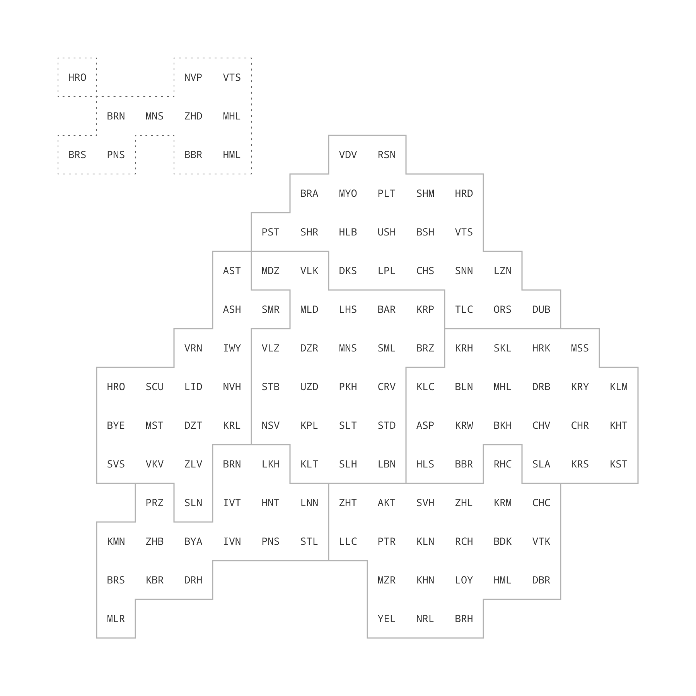

# belarus-tile-grid-map
Tile grid map of the districts of Belarus with an additional block of cities of regional subordination.



CSV and JSON files are located in the ```gridmap``` directory. The following languages are available:

- by — Belarusian, cyrillic
- by-classic — Belarusian Classical Orthography (Tarashkevitsa), cyrillic
- by-latin — Belarusian Classical Orthography (Taraškievica), latinic
- en — English (transcribed from Belarusian)
- en-classic — English (transcribed from Belarusian Classical Orthography)
- ru — Russian

The data in each file is an array of tiles (districts or rayons). Each tile is in this format:

```javascript
[
    {
        "x": "8", // column index
        "y": "8", // row index
        "type": "district",
        "region": "Менская",
        "byName": "Мінскі",
        "byCode": "МНС",
        "enName": "Minsk",
        "enCode": "MNS",
        "ruName": "Минский",
        "ruCode": "МНС",
        "byClassicName": "Менскі",
        "byClassicCode": "МНС",
        "enClassicName": "Myensk",
        "enClassicCode": "MNS",
        "byLatinName": "Mienski",
        "byLatinCode": "MNS"
    },
   ...
]
```
